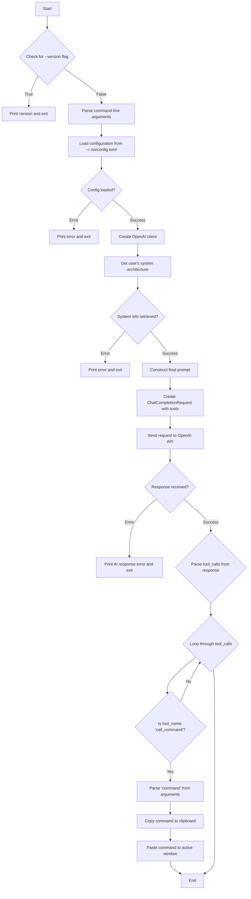

```mermaid
graph TD
    A["Start"] --> B{"Check for --version flag"};
    B -->|True| C["Print version and exit"];
    B -->|False| D["Parse command-line arguments"];
    D --> E["Load configuration from ~/.rsii/config.toml"];
    E --> F{"Config loaded?"};
    F -->|Error| G["Print error and exit"];
    F -->|Success| H["Create OpenAI client"];
    H --> I["Get user's system architecture"];
    I --> J{"System info retrieved?"};
    J -->|Error| K["Print error and exit"];
    J -->|Success| L["Construct final prompt"];
    L --> M["Create ChatCompletionRequest with tools"];
    M --> N["Send request to OpenAI API"];
    N --> O{"Response received?"};
    O -->|Error| P["Print AI response error and exit"];
    O -->|Success| Q{"Parse tool_calls from response"};
    Q --> R{"Loop through tool_calls"};
    R --> S{"Is tool_name 'call_command'?"};
    S -->|Yes| T["Parse 'command' from arguments"];
    T --> U["Copy command to clipboard"];
    U --> V["Paste command to active window"];
    V --> W["End"];
    S -->|No| R;
    R --> W;
```
